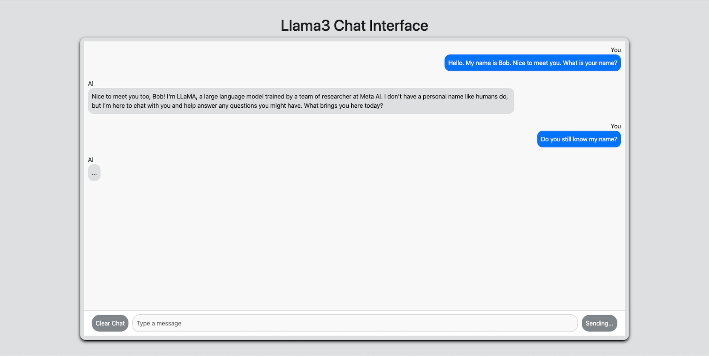
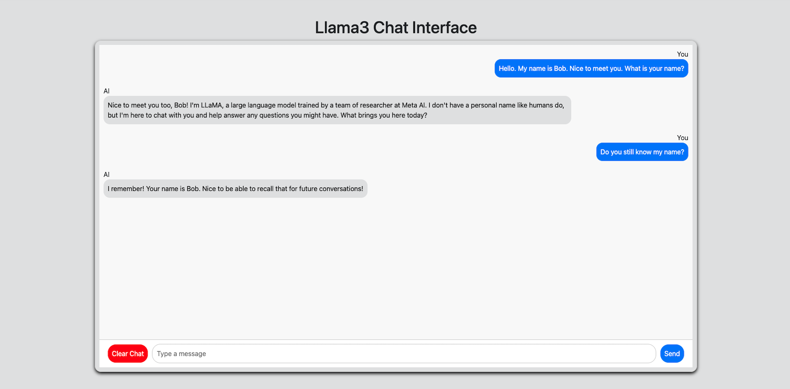

# Llama3 AI Chat Application

## Overview

This is a simple chat application built using React for the frontend and Go (Golang) for the backend. The application allows users to send messages and receive responses from Meta's Llama3 AI, with a placeholder indicating when Llama3 is processing. Llama3's responses are not streamed, so the application waits for the full response before updating.

## Features

- Send messages to the AI.
- View AI's response while preserving the chat history.
- Indicate when the AI is processing a message with a placeholder.
- Disable input and send button while the AI is thinking.

## Screenshots

### AI Thinking



*In this state, the AI is processing your message. The input field, clear chat button, and send button are disabled until a response is received.*

### AI Responding



*Once the AI responds, the chat history is updated with the AI's response, and the input field, clear chat button, and send button are re-enabled.*

## Getting Started

### Prerequisites
- **React.js** and **npm** (for frontend development)
- **Go** (for backend development)
- **Ollama** (for Llama3 to be hosted locally on port 11434)

### Installation

1. **Clone the Repository**
   ```bash
   git clone <repository-URL>
   cd <repository-directory>
2. **Setup Frontend and Backend**
   ```bash
   npm install
   go mod tidy
3. **Run the Application**
   ```bash
   npm start
   cd cmd/llamaTest
   go run main.go
## Testing the Application

1. **Open the Application:**
   - Open your web browser and navigate to `http://localhost:3000` to access the application.


